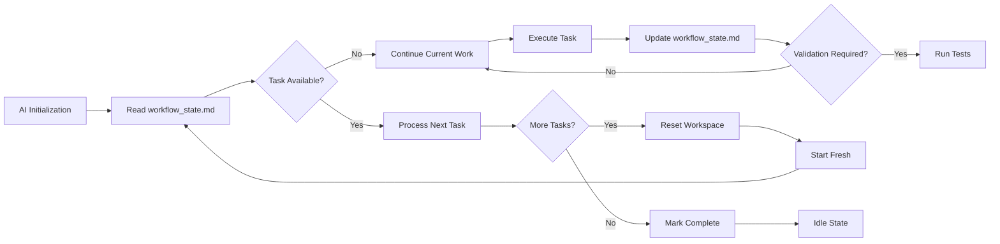

# README.md

# Cursor Natural AI Workflow 


## Overview

Transform your Cursor AI assistant into a true development partner with persistent memory and structured workflows. This system eliminates repetitive explanations and provides consistent, focused assistance by maintaining context throughout your development process.

### Key Benefits

- **Persistent Memory**: Your AI remembers project context and coding preferences
- **Structured Workflows**: Follows a logical progression from analysis to validation
- **Batch Processing**: Handles multiple tasks systematically without losing context
- **Plan Archiving**: Never lose track of your development plans and decisions
- **Git Integration**: Built-in version control support for better collaboration

## How It Works

The system utilizes just two configuration files to manage your AI's behavior:

### `project_config.md`
Your project's long-term memory containing:
- Project goals and requirements
- Technology stack and tool preferences
- Coding standards and patterns
- Performance constraints
- Token management settings

### `workflow_state.md`
The dynamic workspace that tracks:
- Current workflow phase
- Implementation plans and rules
- Activity logs and tool usage
- Task queues and results
- Historical blueprints for reference

## Workflow Process



## Development Phases

1. **Understanding**: Requirements analysis without premature solutioning
2. **Planning**: Detailed step-by-step implementation with blueprint archiving
3. **Building**: Precise execution with error handling and systematic processing
4. **Validation**: Testing and verification against requirements

## Getting Started

1. **Locate Configuration Files**: Find `project_config.md` and `workflow_state.md` in the `cursorkleosr/` directory
2. **Configure Project**: Customize `project_config.md` with your project specifics
3. **Initialize AI**: Use this system prompt in Cursor:
   ```
   You're an autonomous AI developer. Work exclusively with project_config.md and workflow_state.md. 
   Before each action, read workflow_state.md to understand context, follow the rules, 
   then immediately update workflow_state.md with your actions and results.
   ```
4. **Begin Development**: The AI will initialize and request your first task

## Key Features

### Blueprint Archiving
Every plan is automatically archived with timestamps and unique IDs. Retrieve previous plans with natural language:
- "Show me last Tuesday's blueprint"
- "Use blueprint abc123def"
- "Display this week's plans"

### Git Integration
Seamless version control support with:
- Automated commit suggestions
- Progress tracking through commit logs
- Plain English rollback and comparison commands

### Cursor Rules Integration
While `.cursorrules` can still manage global preferences, the workflow intelligence now resides in your configuration files for more context-aware behavior.

## Acknowledgments

Special thanks to:
- @atalas for the Cursor IDE Community User
- @Guayusa for the Cursor IDE Community User
- @stevejb for the Cursor IDE Community User
- @AaronAgility for the Cursor IDE Community User
- @davesienk for the Cursor IDE Community User
- @Marlon for the Cursor IDE Community User
- @DiGI for the Cursor IDE Discord Server
- @ZaZ fopr the Cursor IDE Discord Server
- Contributors to the original `kleosr/cursorkleosr` concepts

## License

This project is licensed under the MIT License - see the LICENSE file for details.

## Contributing

We welcome contributions and improvements to this system. Please share your experiences, refinements, and creative adaptations to help enhance the development workflow for everyone.

---

## Star History

[](https://www.star-history.com/#kleosr/cursorkleosr&Date)

**Note**: This project builds upon the concepts from `kleosr/cursorkleosr` while focusing on simplicity and practicality for everyday development.
