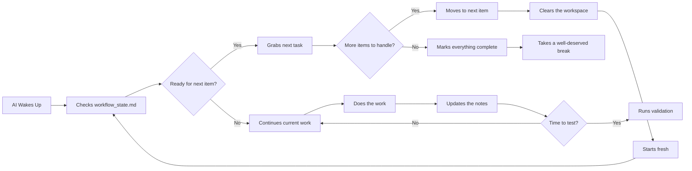

# Making AI Development Feel Natural in Cursor

  
  
<em>Your AI coding companion just got a memory upgrade and a clear playbook</em>

## What's This All About?

Ever wished your AI assistant in Cursor could remember what you're working on and stay focused on the task at hand? That's exactly what this project does. Instead of starting from scratch every conversation, your AI gets a reliable memory system and follows a structured workflow that actually makes sense.

Think of it like giving your AI assistant a notebook to jot down important project details and a step-by-step guide for tackling development tasks. The result? More consistent help, fewer repeated explanations, and development that feels surprisingly smooth.

The best part? This system can now handle lists of items one by one, making it perfect for those times when you need to process multiple similar tasks without losing your mind.

This approach takes inspiration from the original `kleosr/cursorkleosr` repository but cuts out the complexity, focusing on what actually works in day-to-day development.

## Thanks to

*   @atalas [Atalas Cursor IDE Profile](https://forum.cursor.com/u/atalas) 
*   @Guayusa [Guayusa Cursor IDE Profile](https://forum.cursor.com/u/Guayusa) 
*   @stevejb [Stevejb Cursor IDE Profile](https://forum.cursor.com/u/stevejb) 
*   @AaronAgility [AaronAgility Cursor IDE Profile](https://forum.cursor.com/u/AaronAgility/summary) 
*   @davesienk [davesienk Cursor IDE Profile](https://forum.cursor.com/u/davesienk/profile-hidden) 
*   @Marlon [Marlon Cursor IDE Profile](https://forum.cursor.com/u/Marlon) 
*   Contributors to the original `kleosr/cursorkleosr` concepts.

## The Magic Behind the Curtain: Two Simple Files

Instead of juggling tons of configuration files, this system keeps things refreshingly simple with just two key files:

### `project_config.md` - Your Project's Long-Term Memory
This is where you store the stuff that doesn't change much:
- What you're trying to build and why
- Your tech stack and favorite tools
- The coding patterns you love (or hate)
- Performance budgets and constraints
- Token counting settings for keeping conversations manageable

The AI checks this when starting big tasks to understand your project's DNA. You'll update it occasionally, but it's mostly set-and-forget.

### `workflow_state.md` - The Dynamic Brain
This is where the real action happens. It's like your AI's working notebook that gets updated constantly:

- **Current State**: Where you are in the workflow (Analyzing? Building? Testing?)
- **The Plan**: Step-by-step breakdown of what needs to happen next
- **The Rules**: How the AI should behave in different situations
- **Activity Log**: What just happened and what tools were used
- **Item Queue**: Lists of things to process one by one
- **Results Archive**: Summaries and outcomes from completed work
- **Blueprint History**: A clever system that saves all your planning work so nothing gets lost

The AI reads this file before doing anything and updates it immediately after taking action. It's like having a conversation partner who actually remembers the context.

## How Your AI Actually Works

Once you get this running, your AI follows a surprisingly natural rhythm:

In plain English: Your AI reads its notes, figures out what to do next, does it using Cursor's tools, writes down what happened, and repeats. When working through lists, it tackles one item at a time with a clean slate for each.

## The Four Phases That Keep Things Organized

The workflow follows a logical progression that matches how you'd naturally approach development:

1. **Understanding Phase**: "What exactly am I supposed to build here?" The AI digs into requirements without jumping into solutions.

2. **Planning Phase**: "Okay, here's exactly how I'll tackle this." Creates detailed, step-by-step implementation plans while safely archiving previous plans.

3. **Building Phase**: "Time to make it happen." Follows the plan precisely, handles errors gracefully, and processes multiple items systematically.

4. **Validation Phase**: "Does this actually work?" Runs tests and checks to make sure everything meets the requirements.

Each phase has its own focus and constraints, preventing the AI from getting ahead of itself or missing important steps.

## Getting Up and Running

Ready to give your AI assistant this memory upgrade? Here's how:

1. **Find Your Files**: Look for `project_config.md` and `workflow_state.md` in the `cursorkleosr/` directory.

2. **Customize Your Project**: Open `project_config.md` and fill in your project's details - goals, tech stack, coding preferences, and any constraints you care about.

3. **Set Up Your AI**: Start a Cursor chat with a system prompt that tells the AI to work exclusively with these files. Something like:
   
   *"You're an autonomous AI developer. Work solely based on `project_config.md` and `workflow_state.md`. Before every action, read `workflow_state.md` to understand the current state, check the rules, act accordingly, then immediately update `workflow_state.md` with what happened."*

4. **Give It Something to Do**: The AI will initialize itself based on the rules and ask what you'd like to work on first.

## What About That `.cursorrules` File?

Good question! Since the workflow logic now lives in `workflow_state.md`, your main `.cursorrules` file becomes less critical for the day-to-day workflow. You might still use it for global Cursor preferences (like which AI model to use or files to ignore), but the real intelligence lives in the workflow files now.

## Never Lose a Good Plan Again

One of the coolest features is the automatic blueprint history system. Every time you create a new plan, the old one gets safely archived with a timestamp and unique ID. No more "wait, what was that brilliant idea I had yesterday?"

You can easily retrieve old plans with natural commands:
- *"Show me the blueprint from last Tuesday"*
- *"Use blueprint abc123def"*  
- *"What plans do we have from this week?"*

It's like version control for your thinking process.

## Git Integration That Actually Helps

The system includes simple, AI-assisted Git integration that encourages good version control habits. After completing tasks successfully, the AI will suggest committing changes, log commit details to track progress, and help with rollbacks or comparisons using plain English commands.

## License

This project concept is licensed under the MIT License - see the LICENSE file for details.

## Contributing

Found ways to make this system even better? We'd love to hear about it! Share your experiences, refinements, and creative adaptations.
