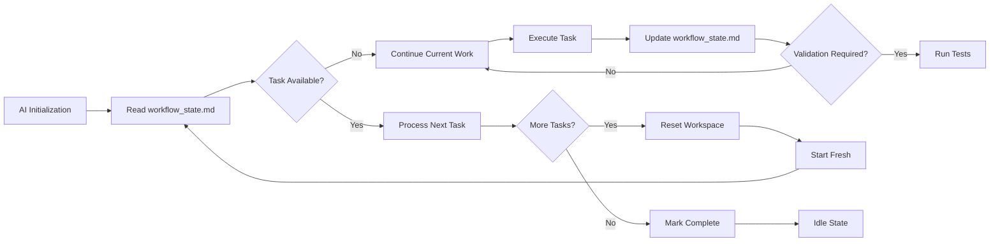

# Cursor Natural AI Workflow

## Overview
Turn Cursor into a context-aware assistant using two files. This system persists memory and structures workflows, preventing repetitive prompting and context loss.

## Key Benefits
- **Persistent Memory**: AI retains context across sessions.
- **Structured Workflows**: Enforces Analyze → Validate steps.
- **Batch Processing**: Handles multiple tasks without context loss.
- **Plan Archiving**: Logs decisions and blueprints for retrieval.
- **Git Integration**: Suggests commits and tracks progress.

## How It Works
Two files control AI behavior:

### `project_config.md` (Long-term Memory)
Stores goals, stack, patterns, constraints, and token limits.

### `workflow_state.md` (Dynamic Workspace)
Tracks current phase, active plan, logs, and tasks.

## Workflow Process


```mermaid
graph LR
    A[AI Initialization] --> B[Read workflow_state.md];
    B --> C{Task Available?};
    C -- Yes --> D[Process Next Task];
    C -- No --> E[Continue Current Work];
    E --> F[Execute Task];
    F --> G[Update workflow_state.md];
    G --> H{Validation Required?};
    H -- Yes --> I[Run Tests];
    H -- No --> E;
    D --> J{More Tasks?};
    J -- Yes --> K[Reset Workspace];
    K --> L[Start Fresh];
    L --> B;
    J -- No --> M[Mark Complete];
    M --> N[Idle State];
```

## Development Phases
1. **Understanding**: Analyze requirements.
2. **Planning**: Create step-by-step blueprints.
3. **Building**: Execute code changes.
4. **Validation**: Verify against requirements.

## Getting Started
1. **Locate Files**: Find `project_config.md` and `workflow_state.md` in the root.
2. **Configure**: Update `project_config.md` with your stack/goals.
3. **Initialize**: Paste this prompt into Cursor:
   ```
   You're an autonomous AI developer. Work exclusively with project_config.md and workflow_state.md. 
   Before each action, read workflow_state.md to understand context, follow the rules, 
   then immediately update workflow_state.md with your actions and results.
   ```
4. **Begin**: The AI will request your first task.

## Key Features

### Blueprint Archiving
Plans are archived with timestamps. Retrieve them with natural language:
- "Show me last Tuesday's blueprint"
- "Use blueprint abc123def"

### Git Integration
- Automated commit suggestions.
- Progress tracking.
- Rollback commands.

### Cursor Rules Integration
Logic resides in configuration files for context-aware behavior, replacing static `.cursorrules` for workflow logic.

## License
MIT License - see [LICENSE](LICENSE).

## Contributing
Submit PRs to improve the workflow.

---

## Star History
[](https://www.star-history.com/#kleosr/cursorkleosr&Date)
