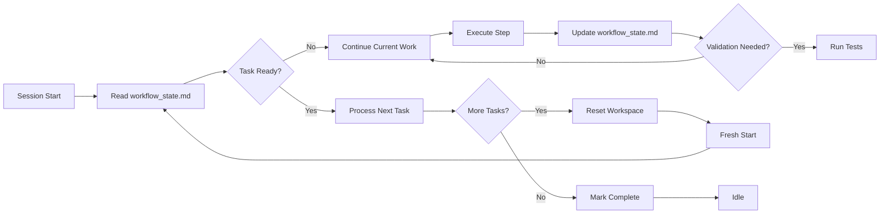

<div align="center">
  
  
  
  
</div>

<br />

<div align="center">
  <h1>cursorkleosr</h1>
  <p><strong>Workflow memory system — one local skill plus root markdown state.</strong></p>
  <p>Keep project context and live task state between agent sessions.<br />Read once, reference always — no more starting from zero.</p>
</div>

<br />

---

## 📦 Setup

```bash
git clone https://github.com/kleosr/cursorkleosr.git
cd cursorkleosr
```

First time? Open `workflow_state.md`, set `Phase: INIT — Status: READY`, then edit `project_config.md` with your project's goals and stack. That's it — no dependencies and no build step.

## 🚀 Usage

```bash
# Direct local-skill path
# Ask Codex to use .skills/workflow-memory.
# Use $workflow-memory in clients that register project skills.
# When tagged, the skill asks what you need, completes it, then stops cleanly.

# Manual fallback before each session
cat workflow_state.md     # Where are we?
cat project_config.md      # What are we building?

# After meaningful work — write state back
# Edit workflow_state.md: update phase, log progress
# Edit project_config.md: update changelog, patterns
```

The loop: **ask what is needed → read state → read config → act → write state back → stop**. Nothing runs automatically — the skill and phases are a structure the agent follows. After fulfillment, it should not ask post-completion questions or require human follow-up.

## 📂 Files

| File | Purpose |
|------|---------|
| `.skills/workflow-memory/SKILL.md` | Codex-facing workflow procedure |
| `.skills/workflow-memory/agents/openai.yaml` | Skill UI metadata |
| `project_config.md` | Slow-changing facts: goals, tech stack, patterns, constraints, changelog |
| `workflow_state.md` | Moving parts: current phase, task table, metrics, log, checkpoints |
| `Instructions.md` | Quick reminder of the read → act → write loop |

## 🔄 Workflow Loop

```
read state → read config → act → write state back
                     ↓
            ANALYZE → PREPARE → IMPLEMENT → VALIDATE
```


```mermaid
graph LR
    S[Session Start] --> A[Read workflow_state.md];
    A --> B{Task Ready?};
    B -- Yes --> C[Process Next Task];
    B -- No --> D[Continue Current Work];
    D --> E[Execute Step];
    E --> F[Update workflow_state.md];
    F --> G{Validation Needed?};
    G -- Yes --> H[Run Tests];
    G -- No --> D;
    C --> I{More Tasks?};
    I -- Yes --> J[Reset Workspace];
    J --> K[Fresh Start];
    K --> A;
    I -- No --> L[Mark Complete];
    L --> M[Idle];
```

## 🏗️ Architecture

```
.
├── .skills/
│   └── workflow-memory/
│       ├── SKILL.md      — Codex workflow procedure
│       └── agents/
│           └── openai.yaml
├── project_config.md    — goals, stack, patterns, constraints, changelog
├── workflow_state.md    — phase, plan, tasks, metrics, checkpoints, log
├── Instructions.md      — loop reminder
└── LICENSE              — MIT
```

Zero dependencies. No build step. The root markdown files remain editable in any editor, diffable in any tool, and greppable from any terminal.

## 🛠️ Development

This is a documentation-only project. No tests, no compilation, no CI pipeline. Validate skill edits with:

```bash
python3 /home/kleosr/.codex/skills/.system/skill-creator/scripts/quick_validate.py .skills/workflow-memory
git diff --check
```

## 🤖 Integration

Designed for Codex-compatible skills while keeping the original markdown workflow usable by any editor or agent. On session start, the skill reads the root state and config files, follows the phase workflow, and writes state back only after meaningful changes. The schema is whatever you write — you own it.

## 🦀 Why Markdown?

Because plain text outlasts everything. No database, no schema migrations, no lock-in, no dependency chain. Root markdown files you can edit in any editor, diff in any tool, and grep from any terminal.

Built for Codex-compatible local skills.

## 📄 License

MIT. See [LICENSE](LICENSE).
