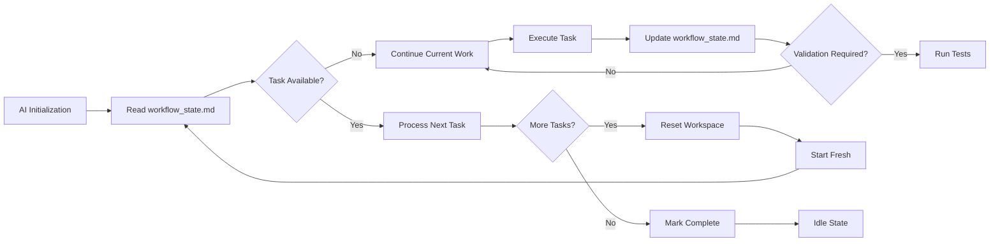

# cursorkleosr

Two markdown files at the repo root carry project memory and live task state for Cursor. The idea is to give the assistant something stable to read on startup instead of re-deriving goals and stack from chat each time.

## Files

`project_config.md` holds slow-changing facts: goals, stack, patterns, constraints, token notes.

`workflow_state.md` holds the moving parts: current phase, plan, task table, metrics, checkpoints, log. The model (or you) is expected to update this as work moves.

`Instructions.md` is a short reminder of the read-act-write loop and which markers are static versus AI-managed.

## Setup

1. Edit `project_config.md` for your project.
2. Set phase and status under the dynamic block in `workflow_state.md` if you are starting from scratch.
3. In Cursor, ask the assistant to read both files before acting and to write results back to `workflow_state.md`.

Example prompt:

```
Use project_config.md and workflow_state.md as the source of truth for workflow memory. Before you act, read workflow_state.md and the rules embedded there. After meaningful steps, update workflow_state.md with what changed and what is next.
```

## Phases

`workflow_state.md` defines INIT → ANALYZE → PREPARE → IMPLEMENT → VALIDATE → COMPLETED or ROLLBACK. Complexity and checkpoint rules live in the same file under the static rules block. None of that runs by itself; it is documentation the assistant is meant to follow when you point it at these files.

## Diagram


```mermaid
graph LR
    A[AI Initialization] --> B[Read workflow_state.md];
    B --> C{Task Available?};
    C -- Yes --> D[Process Next Task];
    C -- No --> E[Continue Current Work];
    E --> F[Execute Task];
    F --> G[Update workflow_state.md];
    G --> H{Validation Required?};
    H -- Yes --> I[Run Tests];
    H -- No --> E;
    D --> J{More Tasks?};
    J -- Yes --> K[Reset Workspace];
    K --> L[Start Fresh];
    L --> B;
    J -- No --> M[Mark Complete];
    M --> N[Idle State];
```

## Blueprints and git

If you archive plans in the log section with a timestamp or id, you can refer back in later chats (“use blueprint abc123”). Git lines in the template mean optional commit suggestions and rollback notes, not hooks or scripts shipped here.

## License

MIT. See [LICENSE](LICENSE).

## Contributing

Pull requests are welcome. For doc tone, use `.cursor/skills/avoid-ai-writing/SKILL.md` as the checklist.

## Star history

[](https://www.star-history.com/#kleosr/cursorkleosr&Date)
