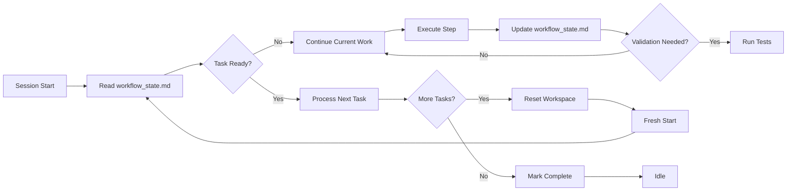

<div align="center">
  
  
  
  
</div>

<br />

<div align="center">
  <h1>cursorkleosr</h1>
  <p><strong>Workflow memory system — two markdown files.</strong></p>
  <p>Keep project context and live task state between Cursor sessions.<br />Read once, reference always — no more starting from zero.</p>
</div>

<br />

---

## 📦 Setup

```bash
git clone https://github.com/kleosr/cursorkleosr.git
cd cursorkleosr
```

First time? Open `workflow_state.md`, set `Phase: INIT — Status: READY`, then edit `project_config.md` with your project's goals and stack. That's it — no dependencies, no build step, no config files to generate.

## 🚀 Usage

```bash
# Before each session
cat workflow_state.md    # Where are we?
cat project_config.md     # What are we building?

# After meaningful work — write state back
# Edit workflow_state.md: update phase, log progress
# Edit project_config.md: update changelog, patterns
```

The loop: **read state → read config → act → write state back**. Nothing runs automatically — the phases are a structure you follow.

## 📂 Files

| File | Purpose |
|------|---------|
| `project_config.md` | Slow-changing facts: goals, tech stack, patterns, constraints, changelog |
| `workflow_state.md` | Moving parts: current phase, task table, metrics, log, checkpoints |
| `Instructions.md` | Quick reminder of the read → act → write loop |

## 🔄 Workflow Loop

```
read state → read config → act → write state back
                     ↓
            ANALYZE → PREPARE → IMPLEMENT → VALIDATE
```


```mermaid
graph LR
    S[Session Start] --> A[Read workflow_state.md];
    A --> B{Task Ready?};
    B -- Yes --> C[Process Next Task];
    B -- No --> D[Continue Current Work];
    D --> E[Execute Step];
    E --> F[Update workflow_state.md];
    F --> G{Validation Needed?};
    G -- Yes --> H[Run Tests];
    G -- No --> D;
    C --> I{More Tasks?};
    I -- Yes --> J[Reset Workspace];
    J --> K[Fresh Start];
    K --> A;
    I -- No --> L[Mark Complete];
    L --> M[Idle];
```

## 🏗️ Architecture

```
.
├── project_config.md    — goals, stack, patterns, constraints, changelog
├── workflow_state.md    — phase, plan, tasks, metrics, checkpoints, log
├── Instructions.md      — loop reminder
├── LICENSE              — MIT
└── .gitignore
```

Zero dependencies. No build step. Two files you can edit in any editor, diff in any tool, and grep from any terminal.

## 🛠️ Development

This is a documentation-only project. No tests, no compilation, no CI pipeline. Contributions that improve clarity, add workflow patterns, or refine the template structure are welcome.

## 🤖 Integration

Designed for Cursor. On session start, the assistant reads both files to reconstruct project context, follows the phase workflow, and writes state back after each action. The schema is whatever you write — you own it.

## 🦀 Why Markdown?

Because plain text outlasts everything. No database, no schema migrations, no lock-in, no dependency chain. Two files you can edit in any editor, diff in any tool, and grep from any terminal.

Built with [Cursor](https://cursor.com).

## 📄 License

MIT. See [LICENSE](LICENSE).
