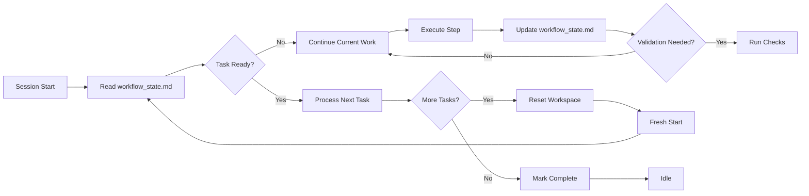

<div align="center">
  
  
  
  
</div>

<br />

<div align="center">
  <h1>cursorkleosr</h1>
  <p><strong>Agent memory that cannot be forgotten — one always-on Cursor rule plus root markdown state.</strong></p>
  <p>Skills wait to be invoked. Rules load every session.<br />The agent reads your project state before it thinks — no more starting from zero.</p>
</div>

<br />

---

## The Breakthrough

Most agent-memory setups are opt-in: a skill the agent must remember to call, a file the human must paste into chat. This one is **always-on**.

`.cursor/rules/workflow-memory.mdc` ships with `alwaysApply: true`, so Cursor injects the operating loop into every agent session automatically. The agent's first move is reading `workflow_state.md` — before you ask for anything. When it finishes meaningful work, it writes state back. Memory stops being a feature you invoke and becomes a property of the repository.

## Setup

```bash
git clone https://github.com/kleosr/cursorkleosr.git
cd cursorkleosr
```

Open `project_config.md`, set your goals and stack. Open `workflow_state.md`, set `Phase: INIT — READY`. Done — no dependencies, no build step.

## Usage

There is nothing to invoke. Open the repo in Cursor and work:

- **Session start** — the agent reads `workflow_state.md` and `project_config.md`, then reconstructs the next action on its own.
- **During work** — one phase at a time: `ANALYZE → PREPARE → IMPLEMENT → VALIDATE`.
- **After meaningful change** — the agent writes state back. No per-message noise.

Manual fallback, from any terminal:

```bash
cat workflow_state.md   # where are we?
cat project_config.md   # what are we building?
```

## Files

| File | Purpose |
|------|---------|
| `.cursor/rules/workflow-memory.mdc` | Always-on operating loop — injected into every agent session |
| `workflow_state.md` | Moving parts: current phase, plan, blockers, log |
| `project_config.md` | Slow-changing facts: goals, stack, patterns, constraints, changelog |
| `Instructions.md` | Human-facing reminder of the read → act → write loop |

## Workflow Loop

```
read state → read config → act → write state back
                     ↓
            ANALYZE → PREPARE → IMPLEMENT → VALIDATE
```


```mermaid
graph LR
    S[Session Start] --> A[Read workflow_state.md];
    A --> B{Task Ready?};
    B -- Yes --> C[Process Next Task];
    B -- No --> D[Continue Current Work];
    D --> E[Execute Step];
    E --> F[Update workflow_state.md];
    F --> G{Validation Needed?};
    G -- Yes --> H[Run Checks];
    G -- No --> D;
    C --> I{More Tasks?};
    I -- Yes --> J[Reset Workspace];
    J --> K[Fresh Start];
    K --> A;
    I -- No --> L[Mark Complete];
    L --> M[Idle];
```

## Architecture

```
.
├── .cursor/
│   └── rules/
│       └── workflow-memory.mdc  — always-on agent operating loop
├── project_config.md            — goals, stack, patterns, constraints, changelog
├── workflow_state.md            — phase, plan, blockers, log
├── Instructions.md              — human loop reminder
└── LICENSE                      — MIT
```

Zero dependencies. No build step. Root markdown stays editable in any editor, diffable in any tool, and greppable from any terminal.

## Development

Documentation-only project. No tests, no compilation, no CI pipeline. Validate edits with:

```bash
git diff --check
```

## Why Markdown?

Plain text outlasts everything. No database, no schema migrations, no lock-in, no dependency chain. State you can read, diff, and grep from anywhere — and a rule the agent cannot ignore.

## License

MIT. See [LICENSE](LICENSE).
