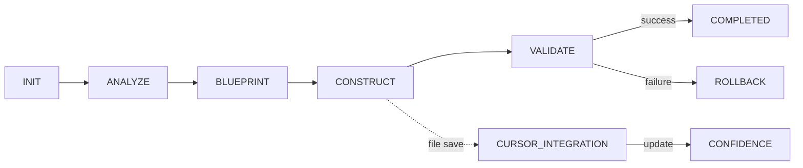

# workflow_state.md
_Last updated: 2025-01-13_

<!-- ==================== STATIC SECTIONS ==================== -->
<!-- These sections contain configuration that can be replaced wholesale -->

<!-- STATIC:RULES:START -->
## Rules
### [PHASE: ANALYZE]  
Read project_config.md & context; write summary.  
Set scope, complexity (1-5), risk level.  
Embedding-based pattern matching → update PatternMatch.  

### [PHASE: BLUEPRINT]  
Archive current plan; draft new steps; set `NEEDS_PLAN_APPROVAL`.  
Assign confidence (1-10). If <7 → request clarification.  
RiskLevel ≥4 → generate rollback script.  

### [PHASE: CONSTRUCT]  
Follow approved plan; run tests; log; set `VALIDATE`.  
Create checkpoint before major changes.  
Micro-phases: CODE → TEST → REVIEW (parallelize if complexity ≥4).  
Auto-integrate with Cursor on file save/test run.  

### [PHASE: VALIDATE]  
Full test pass → `COMPLETED`; trigger `RULE_ITERATE_01`, `RULE_GIT_COMMIT_01`.  
Update metrics and patterns.  
Root-cause analysis if failure → auto-suggest fixes.  

### RULE_INIT_01  
Phase == INIT → ask task → `ANALYZE, RUNNING`.  

### RULE_ITERATE_01  
Status == COMPLETED && Items left → next item, reset.  

### RULE_ADAPTIVE_01  
Simple tasks (complexity 1-2) → skip BLUEPRINT.  
Complex tasks (4-5) → add pre-validation.  

### RULE_ADAPTIVE_02  
If Context contains "quick_fix" OR user history shows high confidence → skip ANALYZE/BLUEPRINT.  
If confidence drops by >30% during phase → auto-trigger PRE_VALIDATION.  

### RULE_PATTERN_01  
Check similar tasks → reuse successful approaches.  

### RULE_PATTERN_02  
If PatternMatch > 85% → auto-inject successful code snippets.  
If PatternMatch < 40% → flag for human review.  

### RULE_ROLLBACK_01  
CONSTRUCT fails → rollback to checkpoint, re-plan with constraints.  

### RULE_ROLLBACK_02  
On failure:  
1. Scan logs for error patterns.  
2. Suggest context-aware fixes.  
After 2 failures → enable SafeMode.  

### RULE_LOG_ROTATE_01  
Log > 3000 chars → archive top 5 lines to ArchiveLog, clear.  

### RULE_SUMMARY_01  
VALIDATE && COMPLETED → prepend one-liner to Changelog.  

### RULE_RISK_01  
In BLUEPRINT:  
- If complexity ≥4 → run dependency static analysis.  
- If risk level = HIGH → generate rollback script.  

### RULE_CONFIDENCE_01  
If confidence drops by >30% during CONSTRUCT → pause and notify user.  

### RULE_PATTERN_03  
Track pattern reuse success rate → deprioritize patterns with <70% success.  

### RULE_CURSOR_INTEGRATION_01  
- On file save → auto-run syntax check → update confidence.  
- On test run → log results → auto-advance to VALIDATE if all pass.  
- If confidence < 7 → show inline pattern suggestion.  

### RULE_BLUEPRINT_ARCHIVE_01  
Before overwrite → save to Blueprint History with time+ID.  

### RULE_BLUEPRINT_REFERENCE_01  
User request → restore/show blueprint.  

### RULE_BLUEPRINT_BRANCH_01  
On request:  
- Create blueprint branch (e.g., `blueprint/feature_x`).  
- Merge to main after approval.  

### RULE_BLUEPRINT_DIFF_01  
Compare blueprints with diff visualization.  

### RULE_SELF_TEST_01  
Weekly:  
- Simulate task → measure phase durations → alert on regressions.  

### RULE_DEPRECATE_01  
If rule unused for 30 days → flag for review.  

## Git Rules
- RULE_GIT_COMMIT_01: prompt commit on VALIDATE pass.  
- RULE_GIT_COMMIT_02: auto-commit with structured message on VALIDATE pass.  
- RULE_GIT_ROLLBACK_01: checkout SHA by description.  
- RULE_GIT_DIFF_01: diff two SHAs.  
- RULE_GIT_GUIDANCE_01: help on request.  
<!-- STATIC:RULES:END -->

<!-- STATIC:VISUALIZER:START -->
## Visualizer

<!-- STATIC:VISUALIZER:END -->

<!-- ==================== DYNAMIC SECTIONS ==================== -->
<!-- These sections are managed by the AI during workflow execution -->

<!-- DYNAMIC:STATE:START -->
## State
Phase: INIT  
Status: READY  
CurrentItem: null  
Confidence: null  
Context: []  
RiskLevel: null  
PatternMatch: null  
SafeMode: false  
<!-- DYNAMIC:STATE:END -->

<!-- DYNAMIC:PLAN:START -->
## Plan
<!-- AI populates -->
<!-- DYNAMIC:PLAN:END -->

<!-- DYNAMIC:ITEMS:START -->
## Items
| id | description | status | complexity | confidence | pattern_match |
<!-- DYNAMIC:ITEMS:END -->

<!-- DYNAMIC:METRICS:START -->
## Metrics
Tasks: 0/0  
Success: 100%  
**Prediction**: Next task success likelihood: 92%  
**Bottlenecks**: Avg. time in BLUEPRINT: 12min (↑ 20%)  
Patterns: []  
<!-- DYNAMIC:METRICS:END -->

<!-- DYNAMIC:CHECKPOINTS:START -->
## Checkpoints
| time | phase | confidence | safe | rollback_script |
<!-- DYNAMIC:CHECKPOINTS:END -->

<!-- DYNAMIC:LOG:START -->
## Log
<!-- tool output (JSON format) -->
<!-- DYNAMIC:LOG:END -->

<!-- DYNAMIC:WORKFLOW_HISTORY:START -->
## Workflow History
<!-- commit SHA & msg -->
<!-- DYNAMIC:WORKFLOW_HISTORY:END -->

<!-- DYNAMIC:ARCHIVE_LOG:START -->
## ArchiveLog
<!-- rotated log summaries -->
<!-- DYNAMIC:ARCHIVE_LOG:END -->

<!-- DYNAMIC:BLUEPRINT_HISTORY:START -->
## Blueprint History
<!-- archived plans -->
<!-- DYNAMIC:BLUEPRINT_HISTORY:END -->
