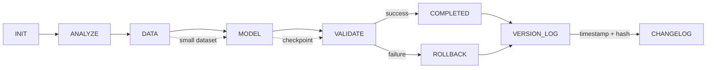

# workflow_state.md
<!-- STATIC:VERSION_INFO:START -->
**Build Version**: v1.0.0  
**Build Timestamp**: <!-- AI updates with current timestamp -->  
**Schema Version**: 1.0  
**Static Content Hash**: <!-- AI calculates hash -->  
<!-- STATIC:VERSION_INFO:END -->

<!-- ==================== STATIC SECTIONS ==================== -->
<!-- These sections contain configuration that can be replaced wholesale -->

<!-- STATIC:RULES:START -->
## Rules
### [PHASE: ANALYZE]  
Read project_config.md & context; assess data requirements & model scope
Set complexity (1-5): 1=simple sklearn, 5=custom architecture
Estimate: dataset size, compute needs, timeline

### [PHASE: DATA]  
Prepare datasets: collection, cleaning, splitting
Create data loaders and preprocessing pipelines  
Validate data quality and distribution
Generate data summary statistics

### [PHASE: MODEL]  
Define model architecture and hyperparameters
Implement training loop with proper logging
Run initial training with baseline metrics
Save model checkpoints with metadata

### [PHASE: VALIDATE]  
Test model performance on validation set
Run inference speed benchmarks  
Generate prediction examples and error analysis
Compare against baseline requirements  

### RULE_FLOW: INIT→ask task→ANALYZE,RUNNING; COMPLETED+items→next,reset  

### RULE_ADAPTIVE: C≤2→skip DATA (use existing); C≥4→extra validation epochs; small dataset→skip DATA phase  

### RULE_PATTERN: Check similar→reuse; >85%→inject; <40%→review; <70%→deprioritize

### RULE_ROLLBACK: MODEL fail→load last checkpoint; DATA fail→clean raw data; 2 fails→reduce complexity  

### RULE_LOG: >3000 chars→archive top 5,clear; VALIDATE+COMPLETED→changelog  

### RULE_RISK: BLUEPRINT+C≥4→static analysis; HIGH→rollback script; confidence drop>30%→pause  

### RULE_CURSOR: file save→syntax check→confidence; test→log→VALIDATE; confidence<7→suggest  

### RULE_BLUEPRINT: Archive before overwrite; restore on request; branch on request; diff visualize  

### RULE_MAINT: Weekly→simulate,measure,alert; unused 30d→flag review

### RULE_DOCS: NEVER auto-create .md files; explicit request only→./docs/

### RULE_VERSION: Update build timestamp on static changes; increment version on breaking changes; log all modifications in changelog; verify hash integrity

### RULE_GIT: VALIDATE pass→prompt|auto-commit; rollback by description; diff SHAs; help on request  
<!-- STATIC:RULES:END -->

<!-- STATIC:VISUALIZER:START -->
## Visualizer

<!-- STATIC:VISUALIZER:END -->

<!-- ==================== DYNAMIC SECTIONS ==================== -->
<!-- These sections are managed by the AI during workflow execution -->

<!-- DYNAMIC:STATE:START -->
## State
Phase:INIT Status:READY Item:null Confidence:null Dataset:null Model:null Checkpoint:null  
<!-- DYNAMIC:STATE:END -->

<!-- DYNAMIC:PLAN:START -->
## Plan
<!-- AI populates -->
<!-- DYNAMIC:PLAN:END -->

<!-- DYNAMIC:ITEMS:START -->
## Items
| id | description | status | complexity | confidence | pattern_match |
<!-- DYNAMIC:ITEMS:END -->

<!-- DYNAMIC:METRICS:START -->
## Metrics
Tasks: 0/0  
Success: 100%  
**Model Performance**: accuracy:null loss:null f1:null
**Data Quality**: missing:null% outliers:null% balance:null
**Training**: epochs:null time:null GPU_util:null%
**Inference**: latency:null ms throughput:null/s
<!-- DYNAMIC:METRICS:END -->

<!-- DYNAMIC:CHECKPOINTS:START -->
## Checkpoints
| time | phase | confidence | safe | rollback_script |
<!-- DYNAMIC:CHECKPOINTS:END -->

<!-- DYNAMIC:LOG:START -->
## Log
<!-- tool output (JSON format) -->
<!-- DYNAMIC:LOG:END -->

<!-- DYNAMIC:WORKFLOW_HISTORY:START -->
## Workflow History
<!-- commit SHA & msg -->
<!-- DYNAMIC:WORKFLOW_HISTORY:END -->

<!-- DYNAMIC:ARCHIVE_LOG:START -->
## ArchiveLog
<!-- rotated log summaries -->
<!-- DYNAMIC:ARCHIVE_LOG:END -->

<!-- DYNAMIC:BLUEPRINT_HISTORY:START -->
## Blueprint History
<!-- archived plans -->
<!-- DYNAMIC:BLUEPRINT_HISTORY:END -->

<!-- DYNAMIC:VERSION_CHANGELOG:START -->
## Version Changelog
| version | timestamp | changes | static_hash | dynamic_changes |
|---------|-----------|---------|-------------|-----------------|

<!-- DYNAMIC:VERSION_CHANGELOG:END -->

<!-- DYNAMIC:DIFF_TRACKING:START -->
## Diff Tracking
<!-- AI populates with build differences -->
<!-- DYNAMIC:DIFF_TRACKING:END -->
