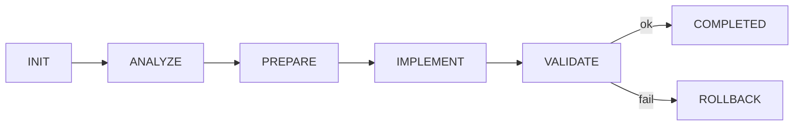

# Workflow State
<!-- STATIC:VERSION_INFO:START -->
v1.2.0 | Schema 1.2
<!-- STATIC:VERSION_INFO:END -->

<!-- STATIC:RULES:START -->
## Rules
### ANALYZE
Load config and context, infer task type, set complexity (1–5), estimate impact.

### PREPARE
Resolve dependencies, draft a plan, find entrypoints, map tests.

### IMPLEMENT
Keep diffs small, keep types strict, reuse helpers, create a checkpoint when complexity is 3 or higher.

### VALIDATE
Run lint, typecheck, and tests; check coverage; summarize the diff; roll back if something fails.

### Flow
INIT → ANALYZE → PREPARE → IMPLEMENT → VALIDATE → COMPLETED or ROLLBACK

### Adaptive
Complexity 2 or lower: fast path. Complexity 4 or higher: extra validation. Flaky tests: rerun.

### Rollback
If IMPLEMENT fails, restore the last checkpoint. After two failures, lower complexity.

### Checkpoint
When complexity is 3 or higher, create one automatically. Store time, phase, confidence, hash, branch.

### Misc
Log over ~3k characters: archive. Risk at complexity 4 or higher: run static analysis. Git: commit after a passing validate step.
<!-- STATIC:RULES:END -->

<!-- STATIC:VISUALIZER:START -->
## Visualizer

```mermaid
graph LR
    INIT-->ANALYZE-->PREPARE-->IMPLEMENT-->VALIDATE
    VALIDATE-->|ok|COMPLETED
    VALIDATE-->|fail|ROLLBACK
```
<!-- STATIC:VISUALIZER:END -->

<!-- DYNAMIC:STATE:START -->
## State
Phase:INIT Status:READY
<!-- DYNAMIC:STATE:END -->

<!-- DYNAMIC:PLAN:START -->
## Plan
<!-- DYNAMIC:PLAN:END -->

<!-- DYNAMIC:ITEMS:START -->
## Items
|id|desc|status|complexity|confidence|files|
<!-- DYNAMIC:ITEMS:END -->

<!-- DYNAMIC:METRICS:START -->
## Metrics
Tasks:0/0 | Quality:0 errors | Diff:0 files
<!-- DYNAMIC:METRICS:END -->

<!-- DYNAMIC:CHECKPOINTS:START -->
## Checkpoints
|time|phase|confidence|hash|branch|
<!-- DYNAMIC:CHECKPOINTS:END -->

<!-- DYNAMIC:LOG:START -->
## Log
<!-- DYNAMIC:LOG:END -->

<!-- DYNAMIC:HISTORY:START -->
## History
<!-- DYNAMIC:HISTORY:END -->
