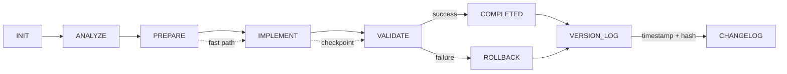

# workflow_state.md
<!-- STATIC:VERSION_INFO:START -->
**Build Version**: v1.1.0  
**Build Timestamp**: <!-- AI updates with current timestamp -->  
**Schema Version**: 1.1  
**Static Content Hash**: <!-- AI calculates hash -->  
<!-- STATIC:VERSION_INFO:END -->

<!-- ==================== STATIC SECTIONS ==================== -->
<!-- These sections contain configuration that can be replaced wholesale -->

<!-- STATIC:RULES:START -->
## Rules
### [PHASE: ANALYZE]  
Load project_config.md and repo context
Infer task type from Model Config Type
Set complexity (1-5): 1=trivial change, 5=cross-module refactor
Estimate: files touched, LOC change, risk, CI time

### [PHASE: PREPARE]  
Resolve dependencies using repo scripts only
Generate plan items from Items table schema
Locate entrypoints, interfaces, and affected modules
Map tests to code paths

### [PHASE: IMPLEMENT]  
Apply minimal diff, maintain contracts and boundaries
Add/modify code with strict typing and tests when required
Reuse utilities; avoid new dependencies unless present in repo
Stage safe checkpoints after each logical unit

### [PHASE: VALIDATE]  
Run lint, typecheck, and tests via repo scripts
Measure coverage and ensure thresholds in project_config.md
Produce diff summary and risk notes
If failures, rollback to last checkpoint and reduce complexity

### RULE_FLOW: INIT→ANALYZE→PREPARE→IMPLEMENT→VALIDATE→COMPLETED|ROLLBACK  

### RULE_ADAPTIVE: C≤2→fast path (skip deep PREPARE); C≥4→extra validation; tests flaky→rerun with seed  

### RULE_PATTERN: Check similar→reuse; >85%→apply; <40%→manual review; <70%→deprioritize

### RULE_ROLLBACK: IMPLEMENT fail→restore last checkpoint; PREPARE fail→use cached state; 2 fails→reduce complexity  

### RULE_LOG: >3000 chars→archive top 5,clear; VALIDATE+COMPLETED→changelog  

### RULE_RISK: PLAN+C≥4→static analysis; HIGH→rollback script; confidence drop>30%→pause  

### RULE_CURSOR: file save→syntax check→confidence; test→log→VALIDATE; confidence<7→suggest  

### RULE_BLUEPRINT: Archive before overwrite; restore on request; branch on request; diff visualize  

### RULE_MAINT: Weekly→simulate,measure,alert; unused 30d→flag review

### RULE_DOCS: NEVER auto-create .md files; explicit request only→./docs/

### RULE_VERSION: Update build timestamp on static changes; increment version on breaking changes; log all modifications in changelog; verify hash integrity

### RULE_GIT: VALIDATE pass→prompt|auto-commit; rollback by description; diff SHAs; help on request  
<!-- STATIC:RULES:END -->

<!-- STATIC:VISUALIZER:START -->
## Visualizer

<!-- STATIC:VISUALIZER:END -->

<!-- ==================== DYNAMIC SECTIONS ==================== -->
<!-- These sections are managed by the AI during workflow execution -->

<!-- DYNAMIC:STATE:START -->
## State
Phase:INIT Status:READY Item:null Confidence:null Files:null Modules:null Checkpoint:null  
<!-- DYNAMIC:STATE:END -->

<!-- DYNAMIC:PLAN:START -->
## Plan
<!-- AI populates with ordered actionable steps -->
<!-- DYNAMIC:PLAN:END -->

<!-- DYNAMIC:ITEMS:START -->
## Items
| id | description | status | complexity | confidence | pattern_match | files | modules |
<!-- DYNAMIC:ITEMS:END -->

<!-- DYNAMIC:METRICS:START -->
## Metrics
Tasks: 0/0  
Success: 100%  
**Quality**: lint_errors:0 type_errors:0 test_failures:0 coverage:null%
**Performance**: build_time_ms:null test_time_ms:null
**Diff**: files_changed:0 loc_added:0 loc_removed:0
<!-- DYNAMIC:METRICS:END -->

<!-- DYNAMIC:CHECKPOINTS:START -->
## Checkpoints
| time | phase | confidence | safe | rollback_script |
<!-- DYNAMIC:CHECKPOINTS:END -->

<!-- DYNAMIC:LOG:START -->
## Log
<!-- tool output (JSON format) -->
<!-- DYNAMIC:LOG:END -->

<!-- DYNAMIC:WORKFLOW_HISTORY:START -->
## Workflow History
<!-- commit SHA & msg -->
<!-- DYNAMIC:WORKFLOW_HISTORY:END -->

<!-- DYNAMIC:ARCHIVE_LOG:START -->
## ArchiveLog
<!-- rotated log summaries -->
<!-- DYNAMIC:ARCHIVE_LOG:END -->

<!-- DYNAMIC:BLUEPRINT_HISTORY:START -->
## Blueprint History
<!-- archived plans -->
<!-- DYNAMIC:BLUEPRINT_HISTORY:END -->

<!-- DYNAMIC:VERSION_CHANGELOG:START -->
## Version Changelog
| version | timestamp | changes | static_hash | dynamic_changes |
|---------|-----------|---------|-------------|-----------------|

<!-- DYNAMIC:VERSION_CHANGELOG:END -->

<!-- DYNAMIC:DIFF_TRACKING:START -->
## Diff Tracking
<!-- AI populates with build differences -->
<!-- DYNAMIC:DIFF_TRACKING:END -->
